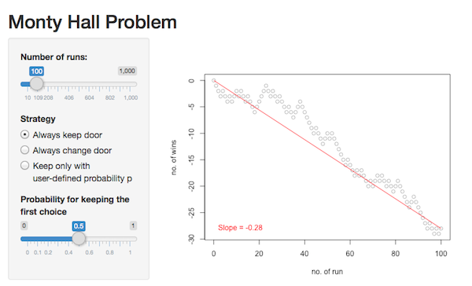

## The Monty Hall problem

You are a candidate in a game show where the host shows you three closed doors. He tells you that there is a car behind one of the doors and goats behind the other two. The game is as follows:

You choose one of the doors. The host, who knows where the car is, opens one of the other doors with a goat behind it. Then, he asks you whether you would like to stick with your original choice or pick the other closed door.

Assuming that you want the car, what should you do?


---

## Different Strategies

When this game is played multiple times in a row, you can follow different strategies:

1. Always stick with the original door.
2. Always switch to the other door.
3. Keep your original choice with a certain probability.

We will solve this problem by simulating the game using a Shiny app:


```r
library(shiny)

# define server logic required to simulate and draw timecourse
shinyServer(function(input, output) {
  [..]
}
```

---

## The Monty Hall problem Shiny app



The Monty Hall problem Shiny app (http://juergen.shinyapps.io/MontyHallProblem) allows you to simulate a user-defined number of Monty Hall problem rounds. A panel on the left side of the app offers controls to set the number of runs to simulate, the strategy to use, and the probability for keeping the original choice for strategy 3.

A plot on the right hand side shows your success. You start with zero points and win one point if you get the car and lose one point if you get a goat. The plot shows your accumulated points (y-axis) over the rounds simulated (x-axis).

The slope of the red straight line connecting the origin with the value of the last run approximates the overall rate of wins.

---

## Solution

As can be easily seen by simulation, the best strategy is always to switch doors. This will yield a car in 2 of 3 cases and a goat in 1 of 3 cases. If one always sticks with the first choice one will only win a car in 1 of 3 cases.

Most people assume that switching does not change the chances of winning and that in both cases there is a 0.5 probability of winning. However, the counterintuitive result that we got by simulating the problem can also be explained by logical arguments. Many different explanations can be found on the web:

- http://en.wikipedia.org/wiki/Monty_Hall_problem
- http://marilynvossavant.com/game-show-problem
- https://www.youtube.com/watch?v=mhlc7peGlGg
